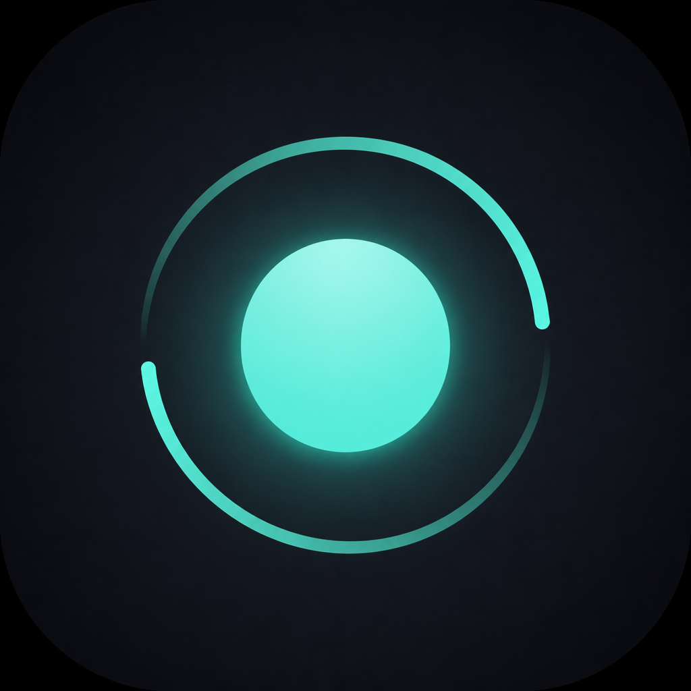

# One more try.

Casual one-tap endless lane game for Android & iOS.

**One tap. One life. One more try.**

Offline · Procedural · Banner ads only (no interstitial, no rewarded, no IAP)



## Stack

- Flutter + Flame
- Local save (`shared_preferences`)
- Google AdMob banner only
- Provider for app state

## Run

```bash
flutter pub get
flutter run
```

## Build release

```bash
# APK (testing / sideload) — desde la rama `test` usa ads de prueba
flutter build apk --release

# Android App Bundle de producción (Google Play) — desde `main`
flutter build appbundle --release
```

APK: `build/app/outputs/flutter-apk/app-release.apk`

## Docs

- [Game Design Document](GAME_DESIGN_DOCUMENT.md)
- [Google Play checklist](STORE_CHECKLIST.md)

## Project layout

| Path | Role |
|------|------|
| `lib/game` | Flame gameplay |
| `lib/generation` | Procedural segments + difficulty |
| `lib/domain` | Skins, medals, missions, progression |
| `lib/data` | Local save |
| `lib/services` | Ads, audio, haptics |
| `lib/presentation` | Screens + widgets |

## AdMob

Banner inferior only (no interstitial, no rewarded).

| Rama | Debug | Release (`.aab` / `.apk`) |
|------|--------|---------------------------|
| `main` | IDs de test de Google | IDs de producción Android |
| `test` | IDs de test de Google | IDs de test de Google |

App ID de producción (Android): `ca-app-pub-2433691102754840~1644832695`. iOS todavía usa IDs de test. Ver `STORE_CHECKLIST.md`.

## License

Proprietary — Facundo Planella. All rights reserved.
